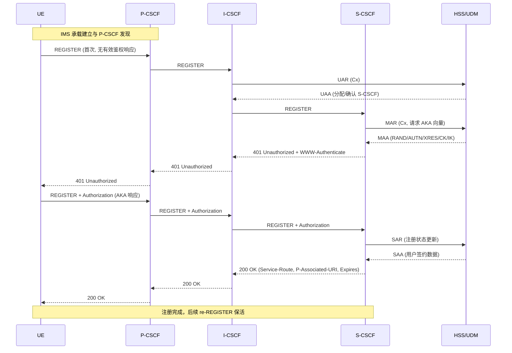

# VoNR-Only IMS 系统架构设计文档

> 版本: 1.0
> 日期: 2026-03-18
> 状态: Phase 1 已实现

---

## 1. 系统架构概览

### 1.1 总体架构

```
                         ┌─────────────────────────────────────────────┐
                         │              IMS System                     │
                         │                                             │
  ┌────┐   Gm(SIP)      │  ┌────────┐   Mw    ┌────────┐   Mw       │
  │ UE ├────────────────►│  │ P-CSCF ├────────►│ I-CSCF ├──────┐     │
  └────┘                 │  └──┬──┬──┘         └───┬────┘      │     │
                         │     │  │                │            │     │
                         │     │  │NG(bencode)  Cx │(UAR/LIR)  │ Mw  │
                         │     │  │                │            │     │
                         │     │  ▼           ┌────┴────┐      ▼     │
                         │     │ ┌──────────┐ │ HSS/UDM │ ┌────────┐ │
                         │     │ │rtpengine │ │ Adapter │ │ S-CSCF │ │
                         │     │ └──────────┘ └────┬────┘ └──┬──┬──┘ │
                         │     │                   │ Cx      │  │     │
                         │  Rx │          (MAR/SAR)│         │  │     │
                         │     ▼                   ▼         │  │     │
                         │  ┌─────┐          ┌──────────┐    │  │     │
                         │  │ PCF │          │ 5GC UDM  │    │  │     │
                         │  └─────┘          └──────────┘    │  │     │
                         │                                    │  │     │
                         │                    ┌───────────────┘  │     │
                         │                    │  Registration    │     │
                         │                    ▼  Store           │     │
                         │               ┌──────────┐           │     │
                         │               │ Memory/  │           │     │
                         │               │ Redis    │           │     │
                         │               └──────────┘           │     │
                         └──────────────────────────────────────┘     │
```

### 1.2 部署模式

#### 独立进程模式（生产环境）

```
┌──────────────┐  ┌──────────────┐  ┌──────────────┐
│  ims_pcscf   │  │  ims_icscf   │  │  ims_scscf   │
│  (port 5060) │  │  (port 5061) │  │  (port 5062) │
└──────┬───────┘  └──────┬───────┘  └──────┬───────┘
       │                 │                 │
       └─────── SIP (Mw) ─────────────────┘
```

每个网元独立进程，通过 SIP Mw 接口通信。可分布式部署在不同主机。

#### 一体化模式（开发测试）

```
┌────────────────────────────────┐
│        ims_allinone            │
│                                │
│  ┌────────┐ ┌────────┐ ┌────┐ │
│  │ P-CSCF │ │ I-CSCF │ │S-  │ │
│  │ :5060  │ │ :5061  │ │CSCF│ │
│  └────────┘ └────────┘ │:5062│ │
│                         └────┘ │
│                                │
│  共享: IoContext, HSS, Store   │
└────────────────────────────────┘
```

所有 CSCF 在同一进程，通过 loopback UDP 通信。共享依赖实例。

---

## 2. 模块架构

### 2.1 模块依赖关系

```
┌─────────────────────────────────────────────────┐
│                 Executables                       │
│  ┌──────────┐  ┌──────────┐  ┌──────────┐       │
│  │ims_pcscf │  │ims_icscf │  │ims_scscf │       │
│  └────┬─────┘  └─────┬────┘  └─────┬────┘       │
│       │              │              │             │
│       └──────────────┼──────────────┘             │
│                      │                            │
├─────────────────────────────────────────────────  │
│                 Libraries                         │
│                      │                            │
│  ┌─────────┐  ┌──────┴─────┐  ┌──────────────┐  │
│  │ims_media│  │  ims_sip   │  │ims_diameter  │  │
│  │(bencode │  │(message,   │  │(cx_client,   │  │
│  │ rtpeng) │  │ transport, │  │ rx_client)   │  │
│  └────┬────┘  │ txn, dlg,  │  └──────┬───────┘  │
│       │       │ stack,     │         │           │
│       │       │ proxy_core)│         │           │
│       │       └──────┬─────┘         │           │
│       │              │               │           │
│  ┌────┴──┐     ┌─────┴──────┐        │           │
│  │ims_dns│     │ims_registr.│        │           │
│  └───┬───┘     └──────┬─────┘        │           │
│      │                │              │           │
│      └────────────────┼──────────────┘           │
│                       │                           │
│                ┌──────┴──────┐                    │
│                │ ims_common  │                    │
│                │(types,config│                    │
│                │ logger, io) │                    │
│                └─────────────┘                    │
└───────────────────────────────────────────────────┘
```

### 2.2 模块职责

| 模块 | 职责 | 主要文件 |
|------|------|----------|
| **ims_common** | 基础设施：类型定义、配置、日志、I/O | types.hpp, config.hpp, logger.hpp, io_context.hpp |
| **ims_sip** | SIP 协议栈：消息解析、传输、事务、Dialog、代理 | message.hpp, transport.hpp, transaction.hpp, dialog.hpp, stack.hpp, proxy_core.hpp |
| **ims_dns** | DNS 解析：NAPTR/SRV/A 链式解析 | resolver.hpp |
| **ims_diameter** | Diameter 客户端：Cx(HSS) 和 Rx(PCF) | ihss_client.hpp, ipcf_client.hpp, cx_client.hpp, rx_client.hpp |
| **ims_media** | 媒体代理控制：bencode 编解码、rtpengine NG 客户端 | bencode.hpp, rtpengine_client.hpp, media_session.hpp |
| **ims_registration** | 注册存储：内存/Redis 后端 | store.hpp, memory_store.hpp |

---

## 3. 核心设计模式

### 3.1 依赖注入

所有外部依赖通过抽象接口注入，便于测试和替换实现：

```cpp
// 接口定义
struct IHssClient {
    virtual auto multimediaAuth(const MarParams&) -> Result<MaaResult> = 0;
    // ...
};

// 生产实现
class FreeDiameterHssClient : public IHssClient { ... };

// 测试 Stub
class StubHssClient : public IHssClient { ... };

// 注入使用
class Registrar {
    Registrar(std::shared_ptr<IHssClient> hss,
              std::shared_ptr<IRegistrationStore> store);
};
```

### 3.2 Result 错误处理

使用 C++23 `std::expected` 替代异常，实现类型安全的错误传播：

```cpp
template<typename T>
using Result = std::expected<T, ErrorInfo>;

// 使用
auto result = hss->multimediaAuth(params);
if (!result) {
    IMS_LOG_ERROR("MAR failed: {}", result.error().message);
    return std::unexpected(result.error());
}
auto& auth_vector = result->auth_vector;
```

### 3.3 RAII 资源管理

所有 C 库资源（osip_message_t、ares_channel 等）通过 RAII 封装：

```cpp
struct OsipMessageDeleter {
    void operator()(osip_message_t* msg) const {
        if (msg) osip_message_free(msg);
    }
};
using OsipMessagePtr = std::unique_ptr<osip_message_t, OsipMessageDeleter>;
```

### 3.4 异步 I/O

基于 boost::asio 的事件驱动架构：

```cpp
class UdpTransport {
    void doReceive() {
        socket_.async_receive_from(buffer, endpoint,
            [this](error_code ec, size_t bytes) {
                // 解析 SIP 消息
                // 回调处理
                doReceive();  // 继续接收
            });
    }
};
```

---

## 4. 关键流程

### 4.1 IMS 注册流程

以下流程描述基于真实运营网 IMS 注册（3GPP 标准流程），不依赖本项目实现细节。

#### 4.1.1 详细步骤

1. UE 建立 IMS 承载，并发现 P-CSCF（常见通过 PCO/DHCP/静态配置）。
2. UE 向 P-CSCF 发送首次 `REGISTER`（不带有效鉴权响应），声明 `Contact` 与能力标签（如 `+sip.instance`、`+g.3gpp.icsi-ref`）。
3. P-CSCF 前转到归属网络；I-CSCF 通过 Cx `UAR/UAA` 向 HSS 查询用户归属并选择/确认 S-CSCF。
4. I-CSCF 将 `REGISTER` 转发给选定 S-CSCF。
5. S-CSCF 触发 AKA 鉴权准备：通过 Cx `MAR/MAA` 向 HSS 获取鉴权向量（RAND/AUTN/XRES/CK/IK）。
6. S-CSCF 返回 `401 Unauthorized`，携带 `WWW-Authenticate`（AKA challenge）；响应经 I-CSCF/P-CSCF 回到 UE。
7. UE 使用 USIM/ISIM 计算鉴权响应，发送第二次 `REGISTER`，在 `Authorization` 中携带响应结果。
8. S-CSCF 校验鉴权成功后，通过 `SAR/SAA` 完成注册状态更新并获取用户签约数据（如 IFC、关联身份）。
9. S-CSCF 建立注册绑定（IMPU/IMPI/Contact/Path/过期时间等），返回 `200 OK`。
10. `200 OK` 通常包含 `Service-Route`、`P-Associated-URI`、`Expires` 等头字段，最终回到 UE，UE 进入已注册状态。
11. 注册后 UE 周期性发送 re-`REGISTER` 保活；去注册时发送 `REGISTER` + `Expires: 0`。

#### 4.1.2 Mermaid 时序图



#### 4.1.3 关键字段与作用

- `WWW-Authenticate`：网络向 UE 下发 AKA 挑战。
- `Authorization`：UE 回传鉴权响应结果。
- `Service-Route`：指示 UE 后续业务请求应经过的服务路由。
- `P-Associated-URI`：网络确认并下发用户可用公共身份集合。
- `Path`：记录接入路径，便于后续请求回到正确接入点。

### 4.2 基本语音呼叫流程

```
UE-A         P-CSCF-A      S-CSCF      P-CSCF-B       UE-B
│              │              │              │              │
│── INVITE ──►│              │              │              │
│  (SDP-A)    │─ rtpengine  │              │              │
│              │  offer      │              │              │
│              │── INVITE ──►│              │              │
│              │  (SDP-A')   │── INVITE ──►│              │
│              │              │  (SDP-A')   │── INVITE ──►│
│              │              │              │  (SDP-A')   │
│              │              │              │              │
│              │              │              │◄── 183 ─────│
│              │              │◄── 183 ─────│  (SDP-B)    │
│              │◄── 183 ─────│              │              │
│              │─ rtpengine  │              │              │
│              │  answer     │              │              │
│              │─ Rx AAR ──► PCF           │              │
│              │  (QoS 5QI=1)│              │              │
│◄── 183 ─────│              │              │              │
│  (SDP-B')   │              │              │              │
│              │              │              │              │
│── PRACK ───►│── PRACK ───►│── PRACK ───►│── PRACK ───►│
│◄── 200 ─────│◄── 200 ─────│◄── 200 ─────│◄── 200 ─────│
│              │              │              │              │
│              │              │              │◄── 200 OK ──│
│              │              │◄── 200 OK ──│  (answer)   │
│              │◄── 200 OK ──│              │              │
│◄── 200 OK ──│              │              │              │
│              │              │              │              │
│── ACK ──────│── ACK ──────│── ACK ──────│── ACK ──────│
│              │              │              │              │
│◄════════════ RTP (via rtpengine) ════════════════════►│
│              │              │              │              │
│── BYE ──────│── BYE ──────│── BYE ──────│── BYE ──────│
│              │─ rtpengine  │              │              │
│              │  delete     │              │              │
│              │─ Rx STR ──► PCF           │              │
│              │◄── 200 ─────│◄── 200 ─────│◄── 200 ─────│
│◄── 200 ─────│              │              │              │
```

---

## 5. 数据模型

### 5.1 注册绑定

```cpp
struct RegistrationBinding {
    string impu;            // sip:user@domain
    string impi;            // user@domain
    string scscf_uri;       // sip:scscf.domain
    vector<ContactBinding> contacts;
    State state;            // Registered | Unregistered | NotRegistered
};

struct ContactBinding {
    string contact_uri;     // sip:user@10.0.0.1:5060
    string instance_id;     // +sip.instance
    string path;            // P-CSCF 路由
    TimePoint expires;
    string call_id;
    uint32_t cseq;
};
```

### 5.2 媒体会话

```cpp
struct MediaSessionState {
    MediaSession session;       // call_id, from_tag, to_tag
    string rx_session_id;       // Diameter Rx 会话
    string caller_sdp;
    string callee_sdp;
    TimePoint created;
    bool qos_active;
};
```

### 5.3 Diameter 类型

```
UAR/UAA: IMPI, IMPU, visited_network → assigned_scscf
MAR/MAA: IMPI, IMPU, auth_scheme → AuthVector(RAND, AUTN, XRES, CK, IK)
SAR/SAA: IMPI, IMPU, assignment_type → UserProfile(ifcs)
LIR/LIA: IMPU → assigned_scscf
AAR/AAA: subscription_id, media_components → session_id
STR/STA: session_id → result_code
```

---

## 6. 技术栈

| 层次 | 技术选型 | 版本 | 用途 |
|------|----------|------|------|
| 语言 | C++20 | GCC 12+ / Clang 15+ | concepts, coroutines, jthread, expected |
| 构建 | CMake | 3.22+ | 跨平台构建 |
| SIP 解析 | libosip2 | 5.x | SIP 消息解析/构造 |
| 异步 I/O | Boost.Asio | 1.80+ | 事件循环, UDP/TCP |
| Diameter | freeDiameter | 1.5+ | Cx/Rx 协议（后续集成） |
| DNS | c-ares | 1.19+ | 异步 DNS 解析 |
| 媒体代理 | rtpengine | 外部进程 | RTP/RTCP 中继 |
| 日志 | spdlog | 1.11+ | 高性能结构化日志 |
| 配置 | yaml-cpp | 0.7+ | YAML 配置解析 |
| 测试 | Google Test | 1.12+ | 单元测试 + Mock |
| 压测 | SIPp | 3.6+ | SIP 场景测试 |

---

## 7. 目录结构

```
ims/
├── CMakeLists.txt              # 顶层构建
├── config/
│   └── ims.yaml                # 配置模板
├── docs/
│   ├── requirements.md         # 需求分析
│   └── architecture.md         # 架构设计（本文件）
├── include/ims/
│   ├── common/                 # 公共类型、配置、日志、I/O
│   │   ├── types.hpp           # Result<T>, ErrorCode, ErrorInfo
│   │   ├── config.hpp          # ImsConfig, load_config()
│   │   ├── logger.hpp          # IMS_LOG_* 宏
│   │   └── io_context.hpp      # IoContext (boost::asio wrapper)
│   ├── sip/                    # SIP 协议栈接口
│   │   ├── message.hpp         # SipMessage (osip2 RAII wrapper)
│   │   ├── transport.hpp       # ITransport, UdpTransport
│   │   ├── transaction.hpp     # Server/ClientTransaction, TransactionLayer
│   │   ├── dialog.hpp          # Dialog, DialogManager
│   │   ├── stack.hpp           # SipStack (集成层)
│   │   └── proxy_core.hpp      # ProxyCore (转发辅助)
│   ├── diameter/               # Diameter 接口定义
│   │   ├── types.hpp           # Cx/Rx 请求响应类型
│   │   ├── ihss_client.hpp     # IHssClient (Cx)
│   │   └── ipcf_client.hpp     # IPcfClient (Rx)
│   ├── media/                  # 媒体接口定义
│   │   ├── types.hpp           # SdpInfo, MediaSession
│   │   └── rtpengine_client.hpp # IRtpengineClient
│   ├── dns/
│   │   └── resolver.hpp        # DnsResolver
│   └── registration/
│       └── store.hpp           # IRegistrationStore
├── src/
│   ├── common/                 # 公共库实现
│   ├── sip/                    # SIP 核心实现
│   ├── dns/                    # DNS 解析器实现
│   ├── diameter/               # Diameter Stub 实现
│   │   ├── cx_client.hpp/cpp   # StubHssClient
│   │   └── rx_client.hpp/cpp   # StubPcfClient
│   ├── media/                  # 媒体实现
│   │   ├── bencode.hpp/cpp     # Bencode 编解码
│   │   ├── rtpengine_client*   # rtpengine NG 客户端
│   │   └── media_session*      # 会话跟踪
│   ├── registration/           # 注册存储实现
│   │   └── memory_store*       # 内存存储
│   ├── pcscf/                  # P-CSCF 服务
│   ├── icscf/                  # I-CSCF 服务
│   ├── scscf/                  # S-CSCF 服务
│   │   ├── registrar*          # 注册管理
│   │   ├── auth_manager*       # AKA 鉴权
│   │   └── session_router*     # 会话路由
│   └── allinone/               # 一体化入口
└── tests/
    ├── mocks/                  # Google Mock
    └── unit/                   # 单元测试
```

---

## 8. 扩展路径

### Phase 2: S-CSCF 注册完善
- 真实 Diameter Cx 客户端（freeDiameter）
- 完整 AKA 鉴权验证（MD5 计算）
- 重注册定时器

### Phase 3: I-CSCF + 注册路由
- DNS NAPTR/SRV 集成
- S-CSCF 能力选择算法

### Phase 4: 语音呼叫信令
- 完整 INVITE/183/PRACK/200/ACK 流程
- Dialog 状态持久化
- MO/MT 路由

### Phase 5: 媒体代理
- rtpengine 集成测试
- SDP 解析和改写

### Phase 6: QoS
- Diameter Rx 真实实现
- 5QI=1 承载建立

### Phase 7: 加固
- 压力测试（SIPp）
- ASan 内存检测
- 事务超时处理完善
